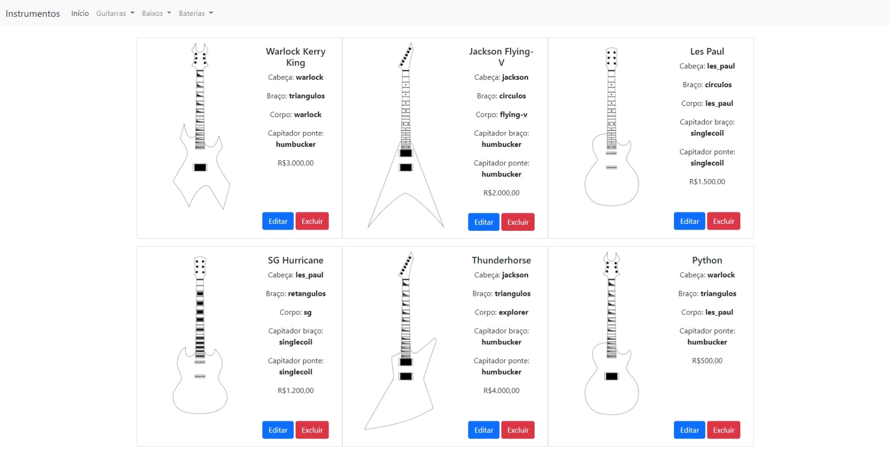

# APLICATIVO INSTRUMENTOS  

Aplicativo para realizar a criação, leitura, atualização e exclusão de intrumentos musicais personalizados 
(até o momento realiza apenas a criação de guitarras)  

## CAPTURAS
Exibição dos instrumentos criados

Criação de uma guitarra
